# 🌩️ AWS Cloud Organization

Este repositorio documenta la creación de una **organización real en AWS**, implementada completamente desde la consola. El objetivo es demostrar conocimientos en buenas prácticas de gobernanza cloud, separación de entornos y administración de múltiples cuentas en un entorno corporativo simulado.

---

## 🎯 Objetivo

Diseñar una arquitectura organizacional en AWS que refleje una estructura empresarial escalable con:

- Separación de entornos (`DEV`, `TEST`, `PROD`, `SECURITY`)
- Control centralizado de facturación
- Jerarquía clara basada en cuentas
- Roles delegados entre cuentas (`OrganizationAccountAccessRole`)
- Documentación visual completa y real
- Preparación para evolucionar hacia **Terraform (IaC)**

---

## 🧰 Tecnologías y herramientas utilizadas

- **Consola de AWS**
- **AWS Organizations**
- **AWS Billing & Cost Explorer**
- **Cambio de rol IAM entre cuentas (`OrganizationAccountAccessRole`)**
- **Draw.io** (para el diagrama de arquitectura)
- **Capturas de pantalla reales** desde la consola AWS

---

## 🧱 Estructura de la organización

```text
Root
├── DEV
│   └── AWS-DEVELOPMENT
├── PROD
│   └── AWS-PROD
├── TEST
│   └── AWS-TEST
├── SECURITY
│   └── AWS-SECURITY
└── AWS-GENERAL (Cuenta de administración)
```

📅 **Fechas de creación:**

- Cuentas DEV y PROD: 19/10/2024  
- Cuenta TEST: 19/04/2025  
- Cuenta SECURITY: 23/07/2025 (agregada desde cuenta existente)

---

## 🖼️ Diagrama de arquitectura

📂 Ver imagen:  
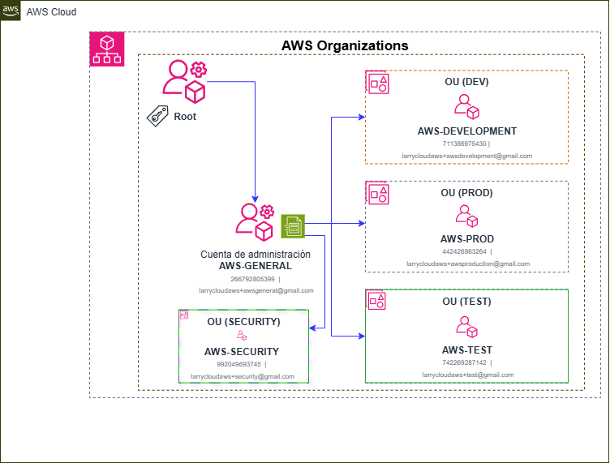

Representa gráficamente la jerarquía OU y las cuentas asociadas a cada entorno, creada en Draw.io.

---

## 📸 Capturas y documentación visual

Capturas reales tomadas desde la consola AWS:  

📁 Ubicación: `docs/screenshots/`

Algunas incluyen:

- Jerarquía en AWS Organizations  
  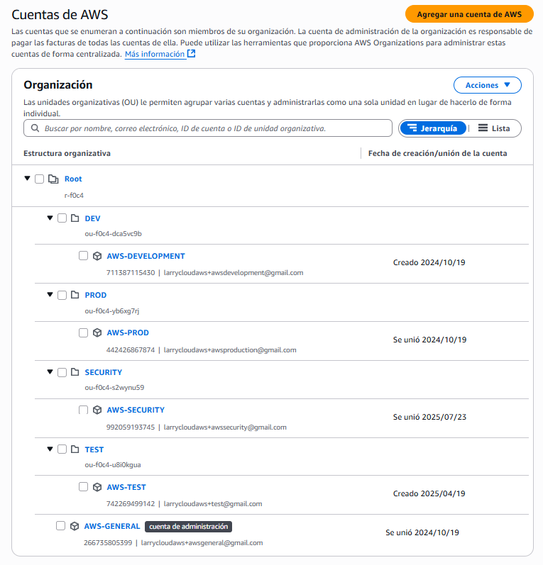

- Configuración de facturación centralizada  
  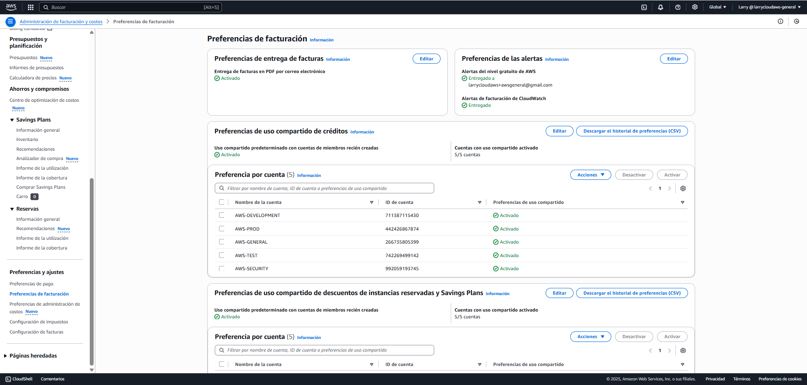

- Consola Cost Explorer mostrando consolidación  
  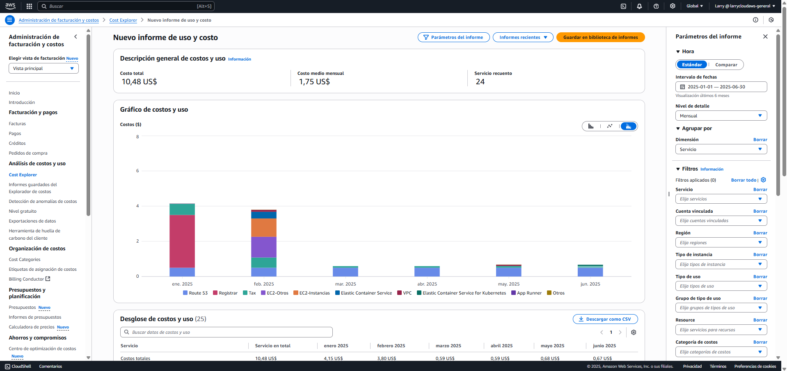
  
- Proceso visual para agregar cuenta existente a la organización  
- Cambio de rol IAM entre cuentas

---

### ✅ Integración de cuenta SECURITY (paso a paso visual)

Se muestra el proceso completo y real de integración de una cuenta AWS existente (`AWS-SECURITY`) dentro de una Organización.

📁 Carpeta: `docs/screenshots/aws-security-account-onboarding/`

---

### 🔖 Pasos documentados:

1. **Enviar invitación desde AWS-GENERAL**  
   .png)

2. **Revisar invitación**  
   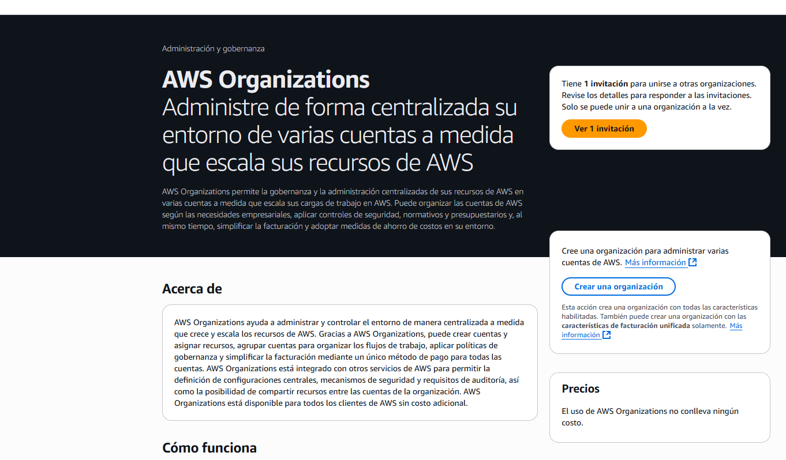

3. **Aceptar invitación desde SECURITY**  
   

4. **Invitación aceptada**  
   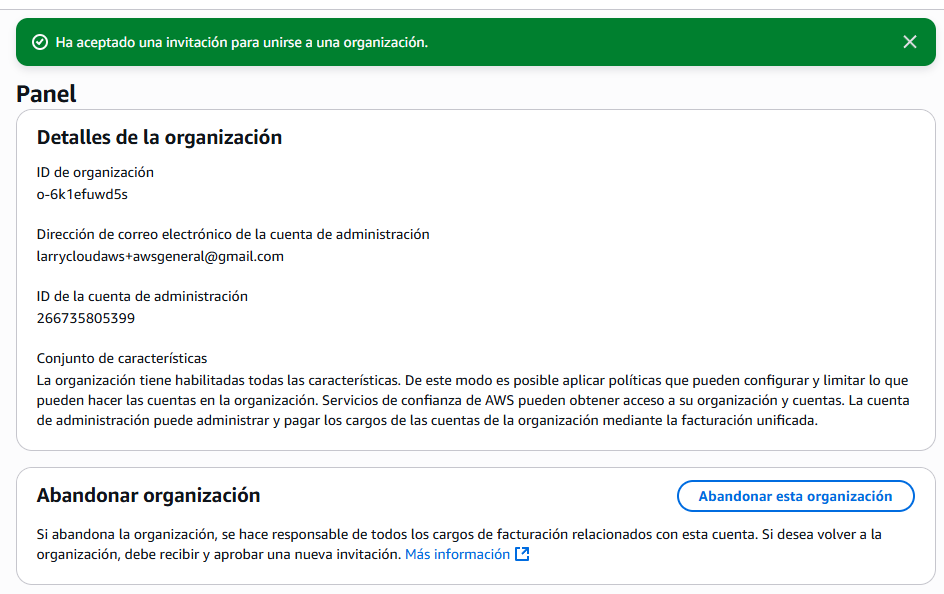

5. **Crear rol de confianza para la cuenta general desde security**  
   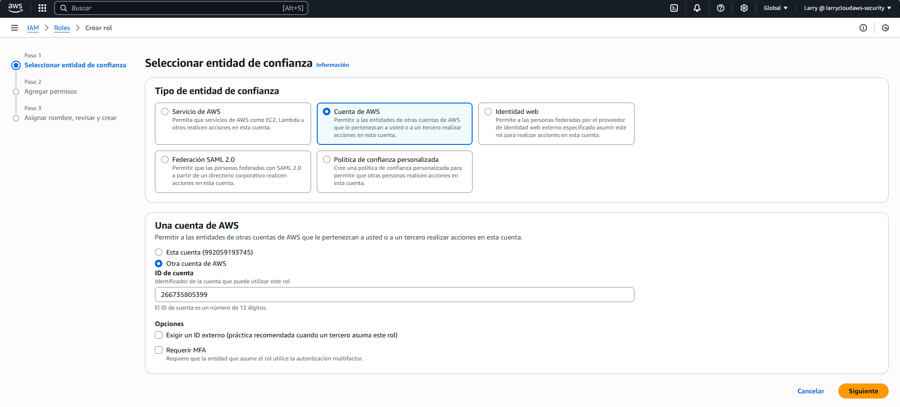

6. **Crear rol `OrganizationAccountAccessRole`**  
   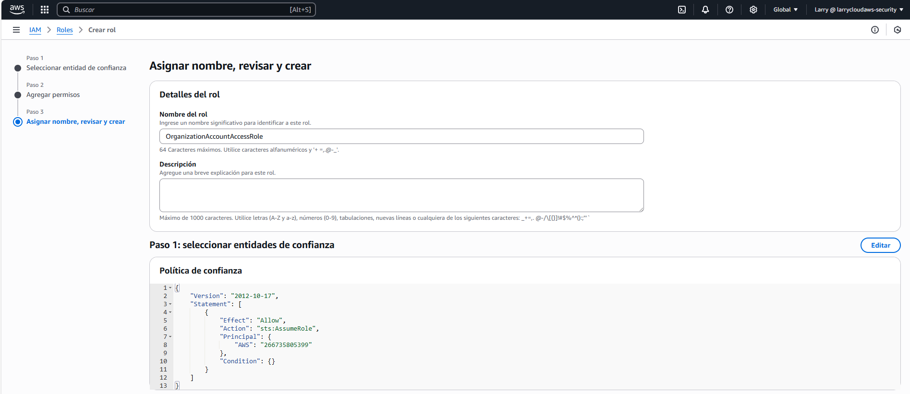

7. **Visualización del rol disponible**  
   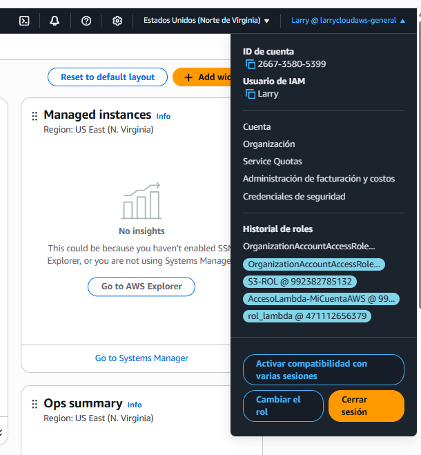

8. **Cambio de rol entre cuentas**  
   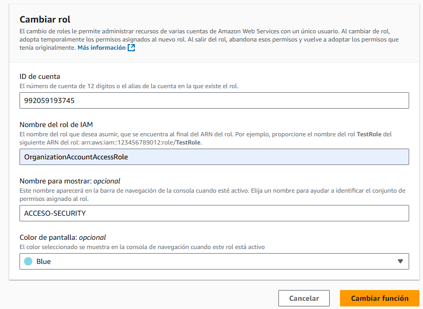

9. **Acceso confirmado desde cuenta SECURITY**  
   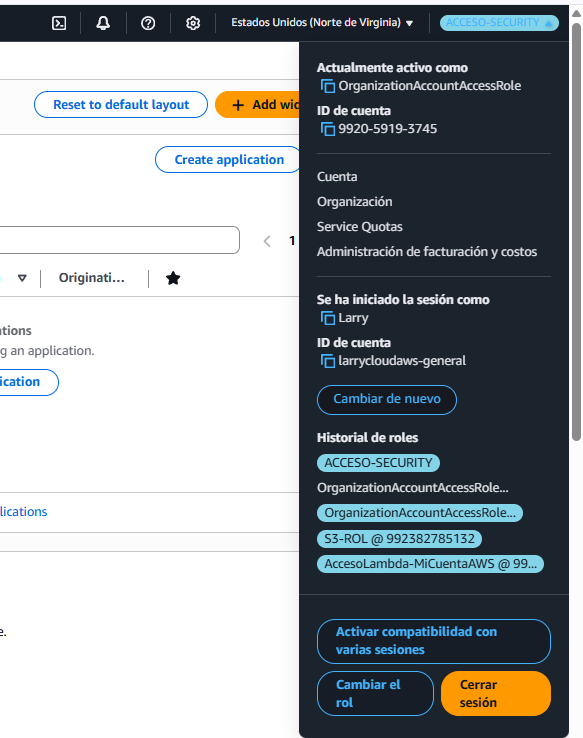

10. **Crear OU SECURITY**  
   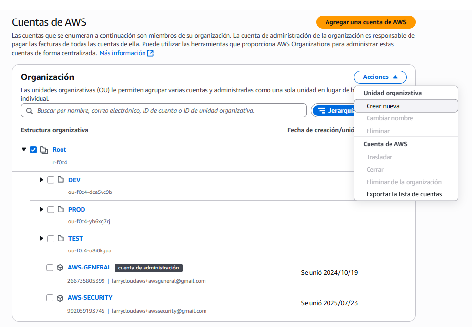

11. **Nombrar la OU SECURITY**  
   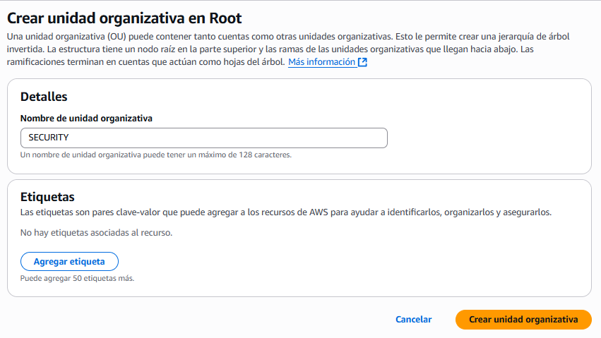

12. **Agregar cuenta SECURITY a la OU**  
   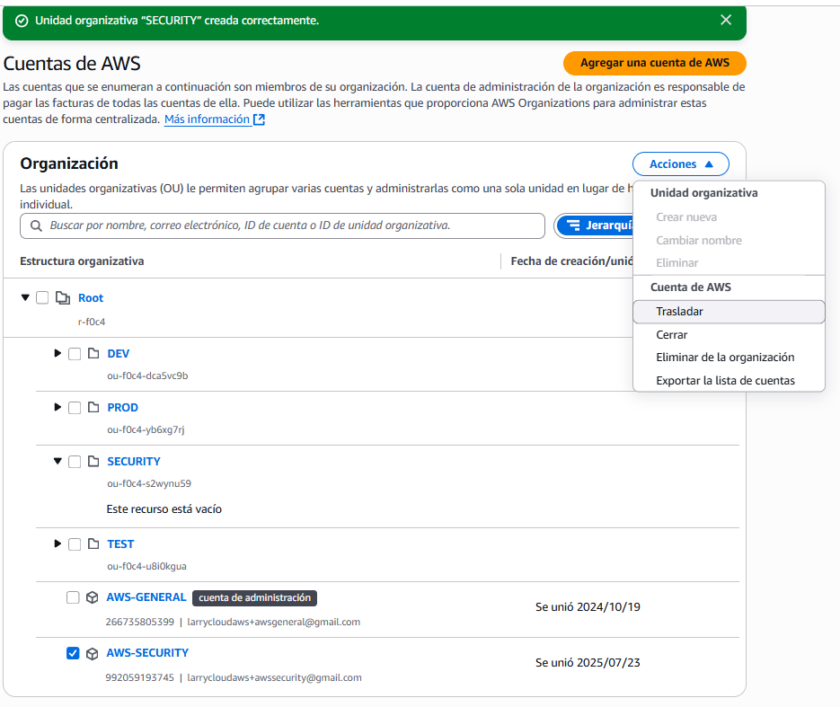

13. **Trasladar cuenta SECURITY a OU SECURITY**  
   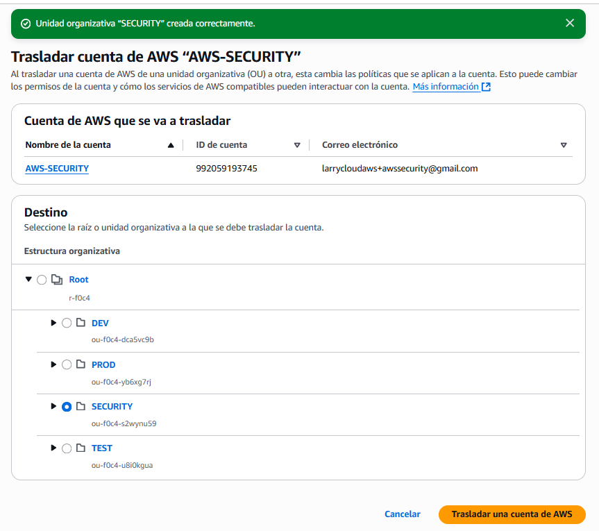

14. **Finalizar traslado de la cuenta SECURITY**  
   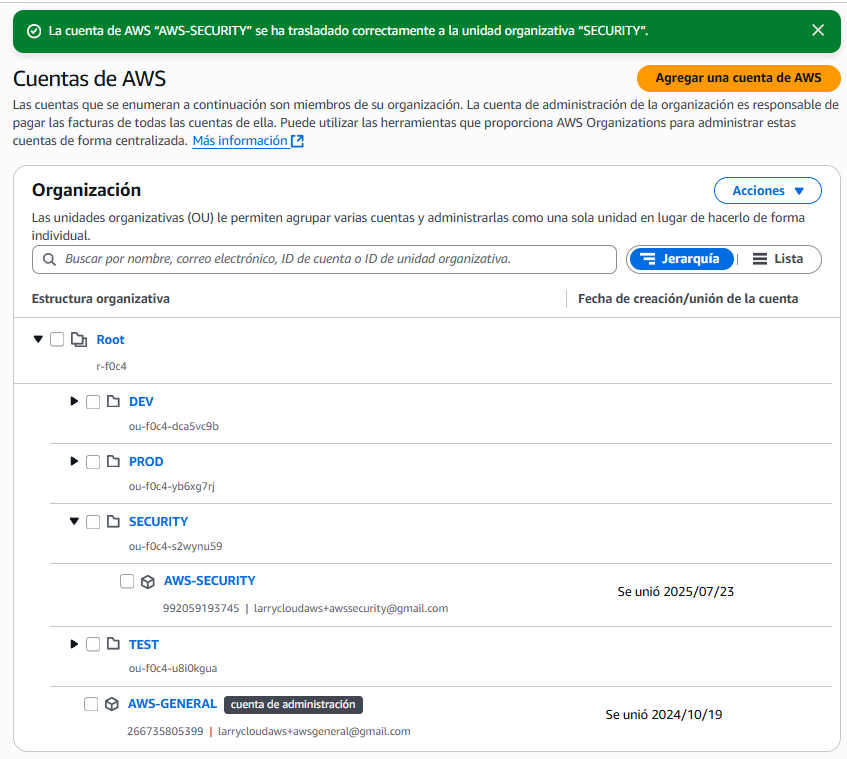

---

## 🔐 Ejemplo visual de política SCP aplicada

Se documenta visualmente cómo aplicar una **política de control de servicios (SCP)** para **denegar el uso de IAM** a la cuenta `AWS-SECURITY`.

📂 Carpeta: `docs/screenshots/SCP/`

### 🔎 Pasos documentados:

1. **Crear política IAMDeny**  
   Política SCP personalizada que deniega el uso de IAM a nivel organizativo.  
   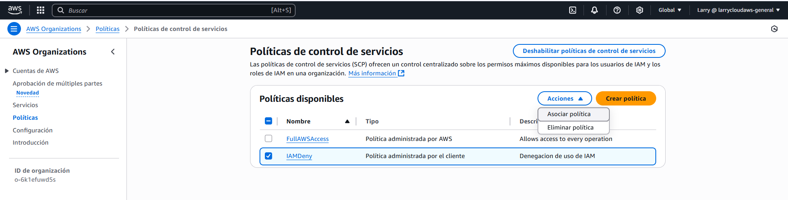

2. **Asociar política IAMDeny**  
   Desde el panel de SCP, se asocia la política a la OU `SECURITY`.  
   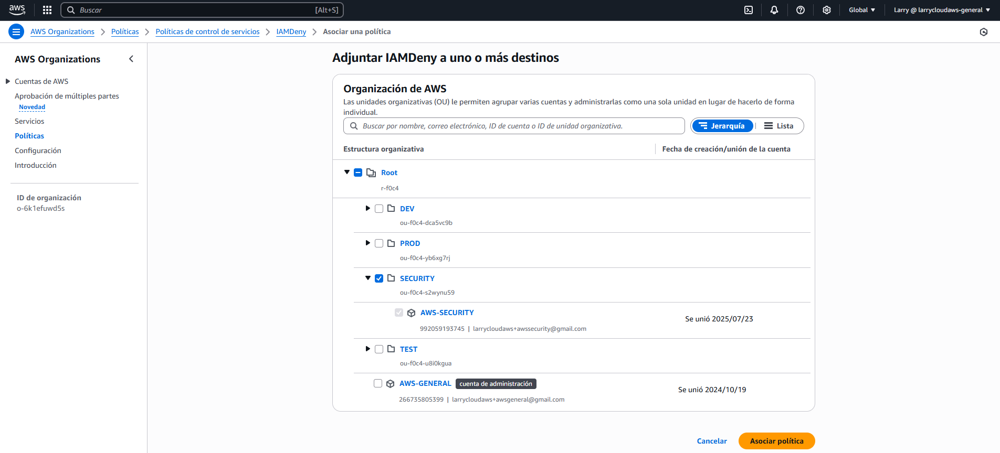

3. **Política asociada correctamente**  
   Confirmación visual de que la SCP fue aplicada correctamente a la OU `SECURITY`.  
   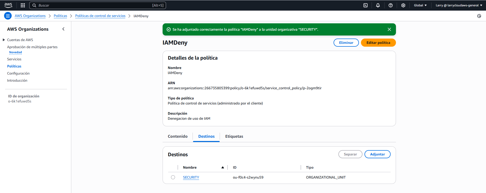

4. **Verificación de denegación efectiva**  
   Desde la cuenta `AWS-SECURITY`, se intenta acceder a IAM y el acceso es denegado explícitamente.  
   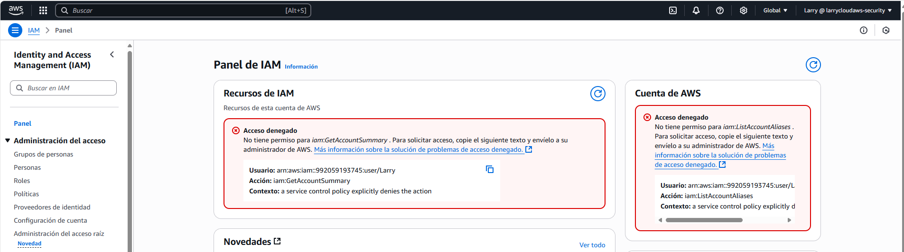

---

## 💳 Configuración de facturación

Todas las cuentas están vinculadas a la cuenta raíz `AWS-GENERAL`, la cual:

- Administra y paga todos los servicios de la organización
- Permite visualización unificada de costos desde Cost Explorer
- Aplica políticas presupuestarias y restricciones en un solo lugar

📸 Captura:  


---

## 💰 Visualización de costos con Cost Explorer

Se utilizó la herramienta **AWS Cost Explorer** desde la cuenta principal `AWS-GENERAL` para analizar el consumo mensual consolidado de la organización. Esta vista permite monitorear los servicios utilizados, sus costos asociados y los patrones de consumo durante los últimos meses.

📊 **Resumen del reporte generado:**

- Costo total: **$10.48 USD**
- Promedio mensual: **$1.75 USD**
- Servicios activos: **24**
- Intervalo visualizado: **Enero 2025 - Junio 2025**
- Agrupado por: **Servicio**

📸 Captura real del informe:  


> 💡 Nota: Las cuentas vinculadas aparecen correctamente configuradas, sin embargo, no figuran individualmente en el reporte porque **aún no han generado consumo directo**.

## 🛠 Futuras mejoras

- ✨ Agregar documentación en Terraform (`main.tf`, `outputs.tf`, `variables.tf`)
- 📊 Configurar alertas y monitoreo inter-cuenta
- 🔄 Automatizar provisión de cuentas sandbox para pruebas

---

## 🙋 Autor

**Larry Andrés Rondan Manrique**  
📬 Email: larrycloudaws@gmail.com  
🐙 GitHub: [@larrycloud](https://github.com/larrycloud)

🛡️ *Nota: Las IDs de cuenta en el diagrama han sido modificadas por motivos de seguridad.*
